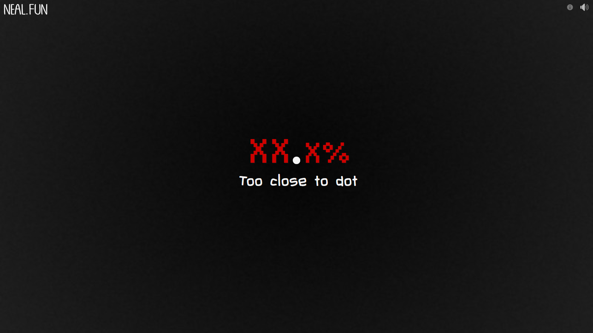

The purpose of this 15 minute challenge is to write a script that gets a perfect 99.9% score on the perfect-circle game found at https://neal.fun/perfect-circle/

This challenge tests some basic trigonometry skills, as well as ability to automate mouse clicks and movements.

The solution that can be found was created by me on 1-October-2023 in 10 minutes 50 seconds using Python with pyautogui to simulate mouse movements and clicks as well as the math library for trignometry functions.

RULES:
1. Set up environment with firstly opening https://neal.fun/perfect-circle/
2. Full screen page by clicking F11 on keyboard
3. Press Go, then click the circle at the center of the screen so that your screen looks like this: 
4. This should be the starting point for code execution, upon starting code execution you are allowed to manually make this window active after running code from IDE. e.g. Alt/Tabbing back in to window.
5. Challenge is complete when you have successfully gained a 99.9% score.

Notes in challenge (probably don't read if planning on attempting, as gives away hints):
1. Originally assumed that the circle needed to be drawn at center of screen, this led to me just dividing the screen width and height by 2 to gain the offsets the circle should be drawn around. I found out the point you need to draw around was off centered which led to me creating the point.py script so I could find the center dots location manually
2. pyautogui limits how many mouse/keyboard clicks can be emulated to hopefully allow cancellation of a script if there is an error in your code, as we need to quickly move the mouse many times we need to override this by editing the PAUSE property of pyautogui
3. I originally used the incrementing count of 100 and radius of 100 pixels but found I was barely off the required 99.9% goal being around 99.7%. I found increasing the value of these parameters was needed to complete the task.